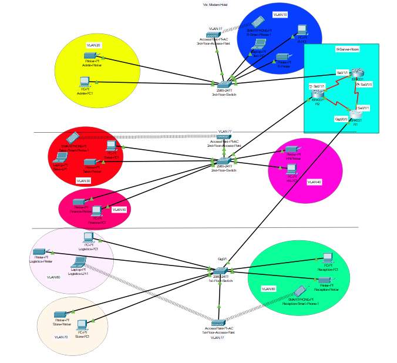
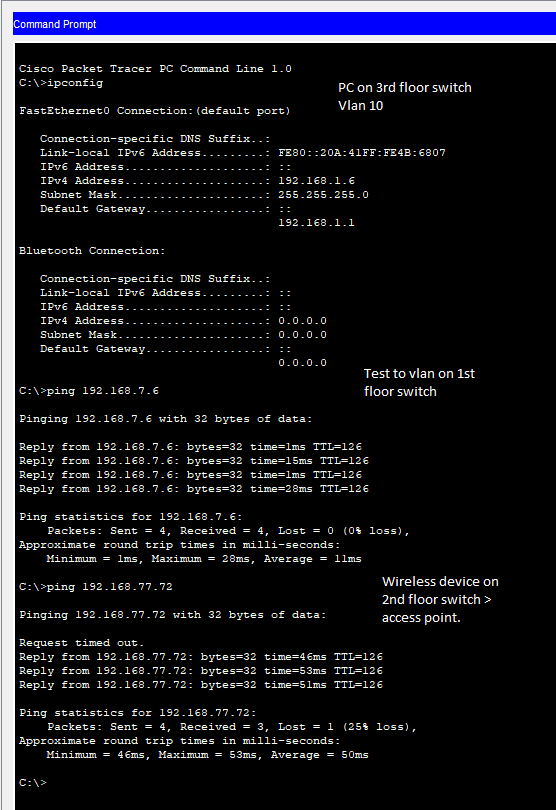
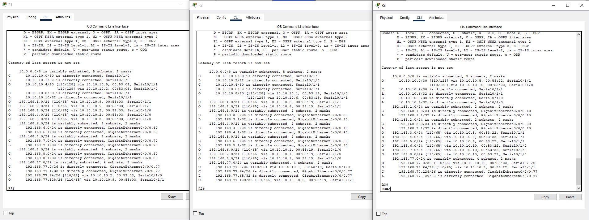
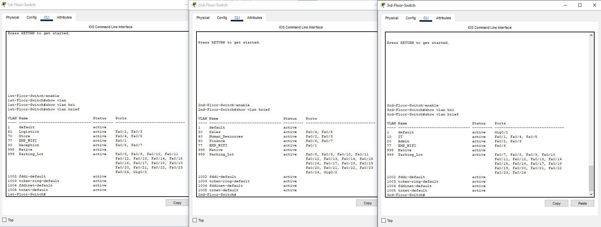
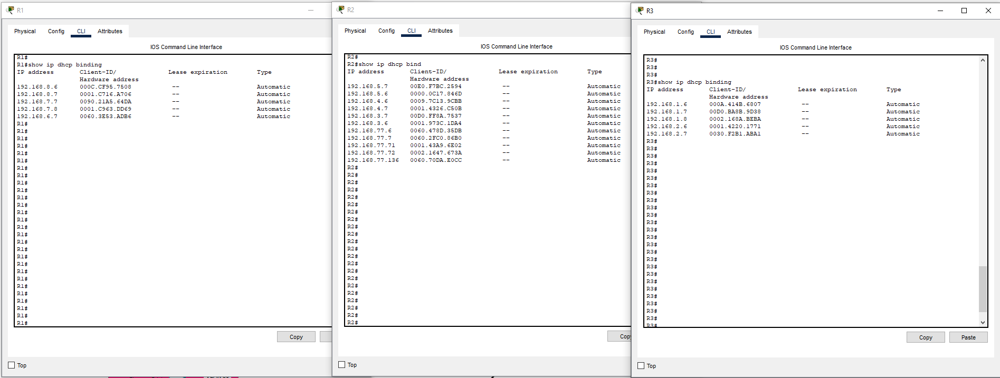
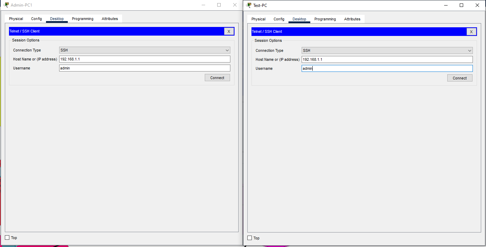
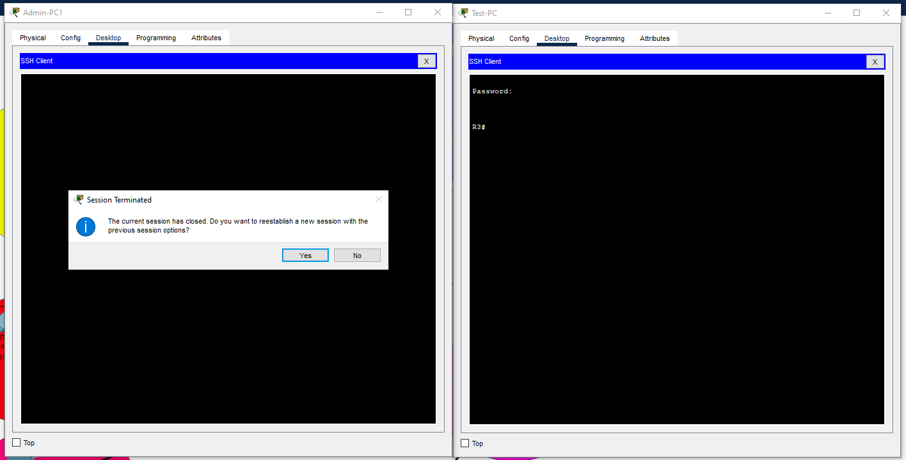

# 🖧 Vic Modern Hotel Network Design – Project #3
**Design and Implementation of a Hotel System Network**  
https://gurutechnetworks.otombenard.com/assetsProject/project3

## 📝 Project Description
Design and implement the Vic Modern Hotel network using Cisco Packet Tracer with the following requirements:

- Three floors:
  - **1st Floor:** Reception, Store, Logistics
  - **2nd Floor:** Finance, HR, Sales/Marketing
  - **3rd Floor:** IT, Admin
- Each floor has one switch and an access point.
- Each department has its own VLAN and printer.
- Three routers connect the floors (all in IT server room) using **serial DCE connections**:
  - R1-to-R2: `10.10.10.0/30`
  - R2-to-R3: `10.10.10.4/30`
  - R1-to-R3: `10.10.10.8/30`
- **OSPF** is the routing protocol.
- Devices obtain IP via DHCP.
- SSH is configured on all routers for remote management.
- Port-security is configured for IT-Test-PC using sticky MACs and violation shutdown.

---

## 🗂️ VLANs & IP Addressing

| Floor       | Department      | VLAN | Network          | Default Gateway   |
|------------|----------------|------|----------------|-----------------|
| 1st Floor  | Reception       | 80   | 192.168.8.0/24 | 192.168.8.1     |
| 1st Floor  | Store           | 70   | 192.168.7.0/24 | 192.168.7.1     |
| 1st Floor  | Logistics       | 60   | 192.168.6.0/24 | 192.168.6.1     |
| 2nd Floor  | Finance         | 50   | 192.168.5.0/24 | 192.168.5.1     |
| 2nd Floor  | HR              | 40   | 192.168.4.0/24 | 192.168.4.1     |
| 2nd Floor  | Sales/Marketing | 30   | 192.168.3.0/24 | 192.168.3.1     |
| 3rd Floor  | Admin           | 20   | 192.168.2.0/24 | 192.168.2.1     |
| 3rd Floor  | IT              | 10   | 192.168.1.0/24 | 192.168.1.1     |
| All Floors | Wireless VLAN   | 77   | 192.168.77.0/26 | Varies by floor |

---

## 🔌 Router Interfaces

### R1

| Interface           | Description             | IP Address       | Subnet Mask     |
|-------------------|------------------------|----------------|----------------|
| Gig0/0/0.60       | R1-to-Logistics VLAN60 | 192.168.6.1    | 255.255.255.0  |
| Gig0/0/0.70       | R1-to-Store VLAN70     | 192.168.7.1    | 255.255.255.0  |
| Gig0/0/0.77       | R1-Wireless VLAN77     | 192.168.77.1   | 255.255.255.192|
| Gig0/0/0.80       | R1-to-Reception VLAN80 | 192.168.8.1    | 255.255.255.0  |
| Serial0/1/0       | R1-to-R2 Serial        | 10.10.10.1     | 255.255.255.252|
| Serial0/1/1       | R1-to-R3 Serial        | 10.10.10.10    | 255.255.255.252|

### R2

| Interface           | Description             | IP Address       | Subnet Mask     |
|-------------------|------------------------|----------------|----------------|
| Gig0/0/0.30       | R2-to-Sales VLAN30     | 192.168.3.1    | 255.255.255.0  |
| Gig0/0/0.40       | R2-to-HR VLAN40        | 192.168.4.1    | 255.255.255.0  |
| Gig0/0/0.50       | R2-to-Finance VLAN50   | 192.168.5.1    | 255.255.255.0  |
| Gig0/0/0.77       | R2-Wireless VLAN77     | 192.168.77.65  | 255.255.255.192|
| Serial0/1/0       | R2-to-R1 Serial        | 10.10.10.2     | 255.255.255.252|
| Serial0/1/1       | R2-to-R3 Serial        | 10.10.10.5     | 255.255.255.252|

### R3

| Interface           | Description             | IP Address       | Subnet Mask     |
|-------------------|------------------------|----------------|----------------|
| Gig0/0/0.10       | R3-to-IT VLAN10        | 192.168.1.1    | 255.255.255.0  |
| Gig0/0/0.20       | R3-to-Admin VLAN20     | 192.168.2.1    | 255.255.255.0  |
| Gig0/0/0.77       | R3-Wireless VLAN77     | 192.168.77.129 | 255.255.255.192|
| Serial0/1/0       | R3-to-R1 Serial        | 10.10.10.9     | 255.255.255.252|
| Serial0/1/1       | R3-to-R2 Serial        | 10.10.10.6     | 255.255.255.252|

---

## 🛠️ Technologies Implemented
- Cisco Packet Tracer network topology
- Hierarchical Network Design
- VLANs and Inter-VLAN Routing (Router-on-a-Stick)
- DHCP Server configuration on routers
- Wireless Access Points (VLAN77)
- SSH for remote router access
- Port-security on IT switch (sticky MAC)
- Subnetting and IP Addressing
- Host device configuration and testing

---

## ✅ Testing & Verification

### Inter-VLAN Communication
- Ping tests between PCs in different VLANs  
-

### Router Configuration Verification
- OSPF routing tables checked with `show ip route`

- VLAN and interface assignments verified using `show vlan brief`

- DHCP bindings verified with `show ip dhcp binding`

- SSH login tested from Test-PC to Router - All working

## 📁 Files in Repository
- `Configs` – Router and Switch Configs  
- `Diagrams` – Network Diagrams  
- `PKT` – Packet Tracer Project File
- `Test_Results` – Test Screenshots 

---

## Author
**Ryan** – Network Engineer Aspirant / CCNA Prep

